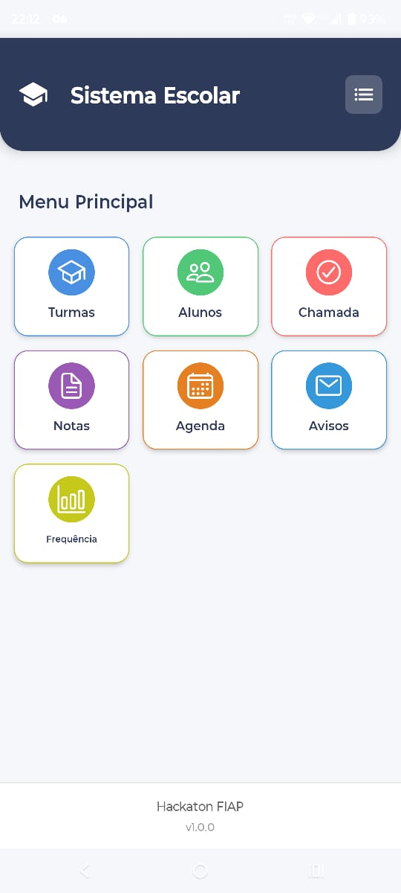
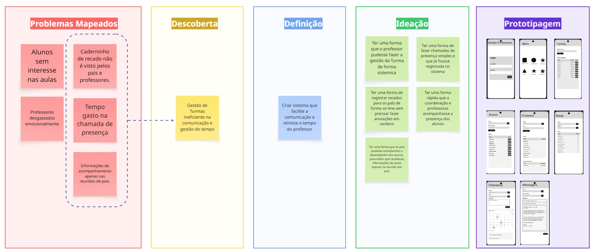
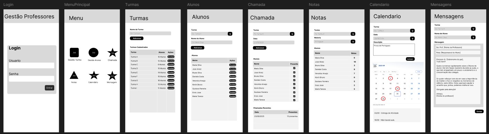
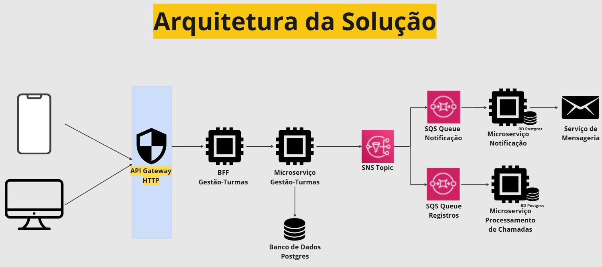
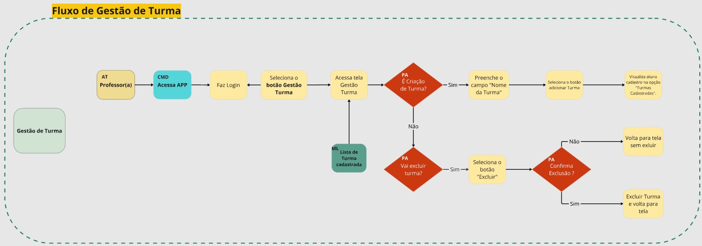
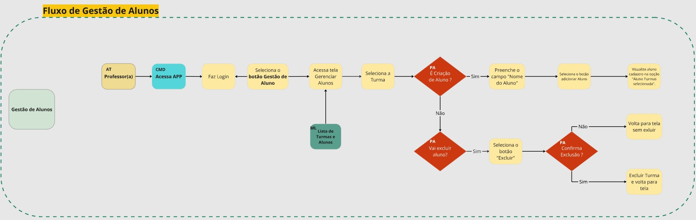
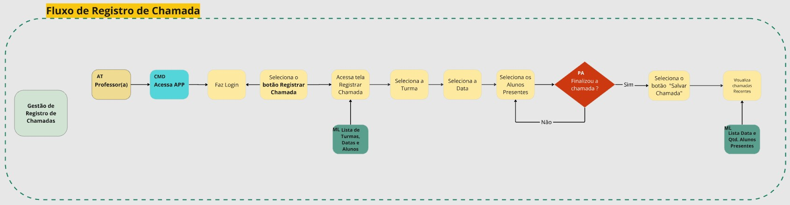
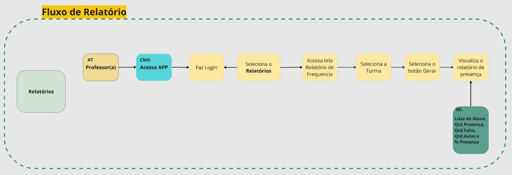

# Documentação do Projeto HackatonFiap

## Solução para Desafios na Educação Pública Brasileira

### Resumo Executivo

A educação pública no Brasil enfrenta múltiplos desafios, como a carência de recursos tecnológicos, a dificuldade de adaptação pedagógica e, principalmente, a ineficiência na comunicação entre professores e responsáveis, além da complexidade no acompanhamento do desempenho e frequência escolar dos alunos. Este cenário resulta em professores sobrecarregados e informações de acompanhamento restritas a reuniões pontuais.

O objetivo central desta iniciativa é aprimorar a rotina e a eficiência dos professores da rede pública de ensino, otimizando a comunicação e a gestão do tempo, conforme identificado em uma sessão de Design Thinking.

### Solução Proposta (Ideia Vencedora e MVP)

A ideia vencedora é uma plataforma que otimiza a comunicação entre professores e responsáveis, abordando a ineficiência da chamada de presença, a falta de visibilidade do "caderninho de recados" e a limitação do acompanhamento dos alunos apenas às reuniões de pais.

#### Solução Geral

A plataforma monitora o desempenho do aluno e emite alertas proativos. O sistema identificará e notificará os responsáveis quando um aluno registrar 3 faltas consecutivas ou estiver próximo de atingir o limite de 10 faltas no mês.

#### MVP (Mínimo Produto Viável)

Para validar a viabilidade da ideia, será desenvolvido um aplicativo móvel intuitivo para professores, que permitirá:

*   Registro Simplificado de Presença: Agiliza o processo de chamada em sala de aula.
*   Geração de Relatórios: Consolida dados de presença para fácil visualização e análise.
*   Alertas e Avisos: Ao atingir 3 faltas consecutivas, o aplicativo poderá gerar um evento para enviar notificações (via e-mail, WhatsApp ou outro serviço de mensageria) aos responsáveis e à coordenação, permitindo uma intervenção precoce.

Este MVP representa um passo fundamental para demonstrar o potencial da solução em otimizar a comunicação e o controle de frequência, impactando diretamente o trabalho dos educadores.



### Vantagens da Solução

A solução oferece benefícios claros para todos os envolvidos e uma arquitetura robusta:

#### Para Educadores e Responsáveis

*   Melhora da Comunicação: Conecta professores e responsáveis de forma eficiente e imediata.
*   Otimização do Tempo: Reduz o tempo gasto em tarefas administrativas, como a chamada.
*   Intervenção Precoce: Alertas automáticos permitem que responsáveis ajam rapidamente em casos de faltas, promovendo a assiduidade escolar.
*   Acompanhamento Contínuo: Informações de desempenho e frequência ficam mais acessíveis e atualizadas.

#### Vantagens da Arquitetura (Tecnológica)

*   Segurança Centralizada: O API Gateway protege os serviços internos e simplifica a gestão de acessos.
*   Adaptação de Interface (BFF - Backend for Frontend): Otimiza a experiência do usuário tanto para aplicativos móveis quanto para interfaces web.
*   Separação de Responsabilidades (Microsserviços): Facilita o desenvolvimento, a manutenção e a escalabilidade independente de cada parte do sistema.
*   Desacoplamento Robusto (SNS e SQS): Garante alta resiliência; se um serviço falha, os outros continuam operando e as mensagens são processadas quando o serviço se restabelece.
*   Escalabilidade e Resiliência: Componentes podem ser escalados independentemente conforme a demanda, e filas de mensagem absorvem picos de carga.

### Sessão de Design Thinking

Durante a sessão de Design Thinking, foram mapeados os seguintes pontos:



#### Mapeamento do Problema e Principais Desafios

*   Alunos sem interesse nas aulas.
*   Professores desgastados emocionalmente.
*   Tempo gasto na chamada de presença.
*   "Caderninho de recados" não é visto por pais e professores.
*   Informações de acompanhamento apenas nas reuniões de pais.

#### Personas

*   Professores
*   Coordenação
*   Responsáveis (pais, mães, avós e parentes próximos)

#### Descoberta e Definição

O consenso foi que a gestão de turmas é ineficiente na comunicação e gestão do tempo. A definição foi desenvolver um sistema que facilite a comunicação e otimize o tempo do professor.

#### Ideação

A etapa de ideação focou em resolver o problema real identificado, gerando o máximo de ideias possíveis com liberdade criativa. A ideia vencedora atende aos tópicos de tempo gasto na chamada, caderninho de recado e acompanhamento em reuniões de pais.

### Prototipação

O protótipo da solução foi desenvolvido e pode ser visualizado no Figma:

*   [Figma](https://www.figma.com/design/M7glyCglra28mjx9LtD27s/Hackathon-Fiap?node-id=27-167&m=dev&t=z9UiZf5kGbcRb0OJ-1)


## Solução Geral - Arquitetura e Funcionamento

A Solução Geral é uma plataforma robusta e escalável, projetada com uma arquitetura de microsserviços para otimizar a comunicação e o acompanhamento de alunos na rede pública.



### Funcionamento Detalhado da Aplicação na Arquitetura Proposta

1.  **Acesso e Login do Professor:** O fluxo começa quando o Professor acessa a aplicação (APP ou Web) e realiza seu login.
2.  **Segurança e Roteamento Centralizado (API Gateway HTTP):** Todas as requisições subsequentes do professor são interceptadas pelo API Gateway HTTP.
    *   Autorização: O API Gateway é o responsável por centralizar a segurança, verificando as credenciais do professor (utilizando padrões como JWT ou OAuth2) para autorizar ou negar a requisição.
    *   Roteamento: Após a autorização, o API Gateway atua como um roteador inteligente, direcionando a requisição para o Backend for Frontend (BFF) específico.
3.  **Adaptação para Experiência do Usuário (BFF - Backend for Frontend Gestão-Turmas):** As requisições autorizadas pelo API Gateway são encaminhadas para o BFF Gestão-Turmas, que otimiza e adapta a requisição para as necessidades específicas da interface (APP ou Web).
4.  **Lógica de Negócio e Persistência de Dados (Microsserviço Gestão-Turmas):** O BFF envia a requisição já processada e adaptada para o Microsserviço Gestão-Turmas, que executa a lógica de gerenciamento de turmas e persiste os dados em seu próprio Banco de Dados Postgres.
5.  **Comunicação Assíncrona e Desacoplamento (SNS e SQS):** Após o Microsserviço Gestão-Turmas realizar sua operação principal e persistir os dados no Postgres, ele publica um evento em um SNS Topic, promovendo alto nível de desacoplamento e resiliência:
    *   Notificações por Serviço de Mensageria: Um SQS Queue Notificação, inscrito no SNS Topic, recebe as mensagens de eventos que requerem notificação. Um Microsserviço Notificação monitora e consome estas mensagens, formatando e enviando as notificações (como e-mail, WhatsApp) aos responsáveis.
    *   Registro de Chamadas de Presença: Outro SQS Queue Registros, também inscrito no SNS Topic, recebe eventos relacionados a registros de presença. Um Microsserviço Processamento de Chamadas consome as mensagens desta fila, processando os eventos para registrar presenças.

### Pontos Fortes da Arquitetura

*   Segurança Centralizada: O API Gateway é a linha de frente para a autorização, protegendo os serviços internos e simplificando a segurança.
*   Adaptação de Interface: O uso do BFF garante que a aplicação seja otimizada tanto para APP quanto para Web, proporcionando uma experiência de usuário e de desenvolvimento mais fluida e eficiente.
*   Separação de Responsabilidades: Cada microsserviço tem uma função bem definida (Gestão-Turmas, Notificação, Processamento de Chamadas), o que facilita o desenvolvimento, a manutenção e a escalabilidade independente de cada parte do sistema.
*   Desacoplamento Robusto: A comunicação assíncrona via SNS e SQS é fundamental. Se, por exemplo, o serviço de notificação estiver temporariamente indisponível, o microsserviço de Gestão-Turmas continua funcionando normalmente, e as mensagens aguardam na fila SQS para serem processadas assim que o serviço de notificação se restabelecer. Isso aumenta drasticamente a resiliência do sistema.
*   Escalabilidade e Resiliência: Componentes podem ser escalados independentemente conforme a demanda. As filas SQS absorvem picos de carga, evitando sobrecarga nos serviços consumidores.
*   Observabilidade: A arquitetura orientada a eventos facilita a implementação de monitoramento e rastreamento do fluxo de dados e eventos através do sistema.

### Fluxos da Aplicação

O documento detalha os fluxos da aplicação para as seguintes funcionalidades:

*   Gestão de Turmas
*   Gestão do Aluno
*   Registro de Chamada
*   Relatório






## Tecnologias Utilizadas

As tecnologias foram divididas em duas etapas:

### 1. Tecnologia utilizada no MVP

Com foco em validar a ideia com uma abordagem mais simples:

*   Framework Principal: React Native
*   Backend as a Service (BaaS): Firebase (para Autenticação)
*   Ambiente de Desenvolvimento: Vscode e Expo

### 2. Tecnologia idealizada para o ambiente produtivo

Pensando em atender diversas escolas públicas com um ambiente robusto:

*   Framework Principal: React Native
*   Backend as a Service (BaaS): Firebase (para Autenticação e Functions)
*   Segurança e Roteamento Centralizado: API Gateway HTTP
*   Backend (BFF e Microsserviço): Node com TypeScript
*   Banco de Dados: Postgres
*   Serviço de Mensageria: Amazon SNS e SQS (Comunicação Assíncoplona e Desacoplamento)

## Estrutura de Pastas do Projeto

A estrutura de pastas do projeto segue uma organização padrão para facilitar o desenvolvimento.


## Dependências Principais

O projeto utiliza as seguintes dependências (verifique o arquivo `package.json` para detalhes e versões exatas):

*   `react` / `react-dom`: Biblioteca principal para construção da interface.
*   `react-native`: Framework para desenvolvimento mobile (se aplicável).
*   `expo`: Ferramenta para desenvolvimento React Native (se aplicável).
*   `@react-navigation/`: Navegação entre telas.
*   `axios`: Requisições HTTP.
*   `styled-components`: Estilização de componentes.
*   `typescript`: Tipagem estática para JavaScript (se aplicável).
*   `eslint` / `prettier`: Ferramentas de lint e formatação de código.

## Como Rodar o Projeto

1.  Instale as dependências:
    ```bash
    npm install
    ```
2.  Inicie o projeto:
    ```bash
    npm run start
    ```

**Observações:**

*   Certifique-se de ter o Node.js instalado.
*   Para desenvolvimento mobile, configure o ambiente conforme a documentação do React Native ou Expo.
  
login de teste: professor@teste.com  123456
## Repositório

O código-fonte do projeto está disponível nos seguintes repositórios:

*   [https://github.com/gp33postech/HackatonFiap](https://github.com/gp33postech/HackatonFiap)
*   [https://github.com/gp33postech/HackatonFiap.git](https://github.com/gp33postech/HackatonFiap.git)

## Aprendizados da Equipe e Próximos Passos

### Complexidade do Ambiente Escolar Público

*   Mapeamento de Dores: A estruturação de soluções para escolas públicas revelou-se extremamente desafiadora, principalmente na identificação e compreensão das necessidades reais do ambiente educacional público.
*   Diagnóstico Sistêmico: Os problemas vão além de questões técnicas, envolvendo aspectos sociais, econômicos e culturais específicos da educação pública.

### Barreira Real: Tempo vs. Tecnologia

*   Quebra de Paradigma: Contrariando expectativas iniciais, a limitação tecnológica não é o principal obstáculo.
*   Fator Humano: O verdadeiro desafio reside na disponibilidade de tempo dos pais/responsáveis para acompanhar o desempenho escolar dos filhos.
*   Priorização: Muitas famílias enfrentam demandas socioeconômicas que competem com o tempo dedicado ao acompanhamento educacional.

### Oportunidades de Aprimoramento Futuro

#### Mecanismo de Engajamento Obrigatório

*   Proposta: Implementar um sistema de acordos quinzenais entre pais/responsáveis e a instituição.
*   Objetivo: Garantir participação ativa no processo educacional como requisito para a manutenção da matrícula.
*   Impacto Esperado: Criar uma cultura de acompanhamento sistemático e responsabilidade compartilhada.

#### Próximos Passos

*   Desenvolver interface intuitiva para facilitar o engajamento parental.
*   Criar alertas e lembretes automatizados.
*   Estabelecer métricas de acompanhamento e feedback contínuo.
